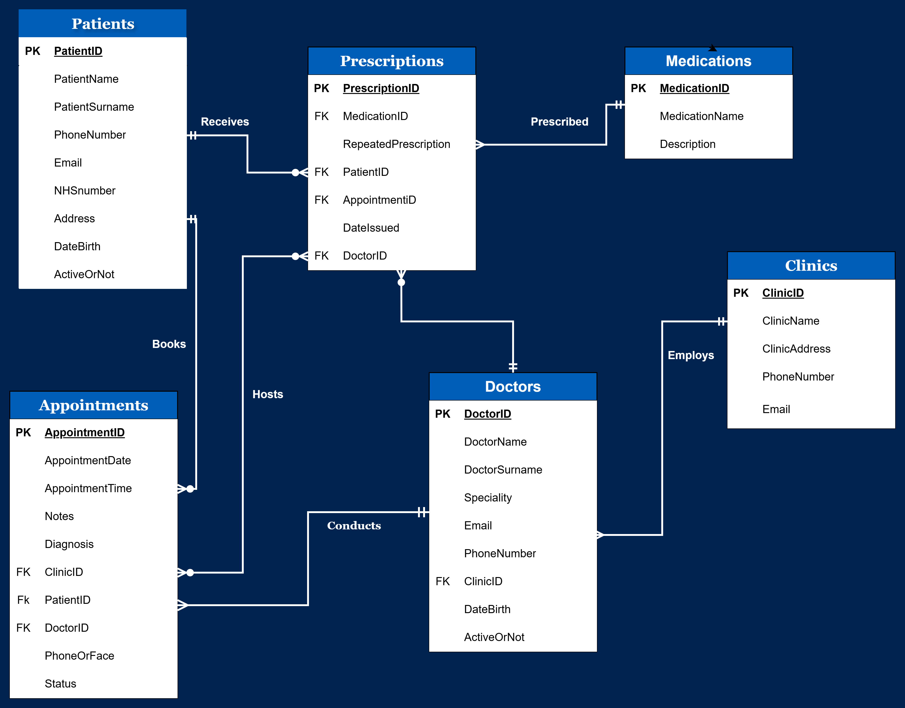

# NHS Trust Database (NHS_Trust_DB)

A normalised relational database built in MySQL for a simulated NHS UK digital transformation initiative — replacing patient records kept in Word and Excel with a secure, structured system for managing patients, doctors, clinics, appointments, medications, and prescriptions.

## Overview

The database models a small NHS Trust's operation: patients booking appointments with doctors across clinics, doctors issuing prescriptions for medications, and administrative staff managing it all — with data integrity and access control built in from the schema up.

The design was normalised through 1NF, 2NF, and 3NF to remove redundancy and anomalies present in the original unstructured records, resulting in six related tables:

- **Patients**
- **Doctors**
- **Clinics**
- **Medications**
- **Appointments**
- **Prescriptions** — a junction table resolving the many-to-many relationship between patients and medications



## Files

| File | Purpose |
|---|---|
| `tables.sql` | Creates `NHS_Trust_DB` and all six tables, with primary/foreign keys and UNIQUE/CHECK constraints (valid email formats, sensible date-of-birth ranges, no duplicate bookings) |
| `populate-db.sql` | Seeds the tables with realistic synthetic data for testing |
| `data-manipulation-queries.sql` | Reporting and automation: clinic performance analysis (aggregation + LEFT JOIN), a data-integrity check across joined tables, doctor workload ranking (`DENSE_RANK()`), a stored procedure that automates appointment booking, and a trigger that normalises doctor specialities |
| `assign-roles.sql` | Sets up role-based access control — doctor, receptionist, admin, and patient roles, each scoped to only the data and operations it needs |
| `hash-encryption.sql` | Secures patient passwords with SHA-2 hashing and encrypts sensitive diagnosis data with AES |

## Setup

Requires MySQL 8.0+.

```bash
mysql -u <user> -p < tables.sql
mysql -u <user> -p NHS_Trust_DB < populate-db.sql
mysql -u <user> -p NHS_Trust_DB < assign-roles.sql
mysql -u <user> -p NHS_Trust_DB < hash-encryption.sql
mysql -u <user> -p NHS_Trust_DB < data-manipulation-queries.sql
```

## Security

- Role-based access control, enforced with the principle of least privilege
- Patient passwords hashed with SHA-2 (never stored in plain text)
- Sensitive clinical data (diagnoses) encrypted with AES
- Business rules enforced at the database level (appointments restricted to weekday working hours, no duplicate bookings)
- Prepared statements used to prevent SQL injection